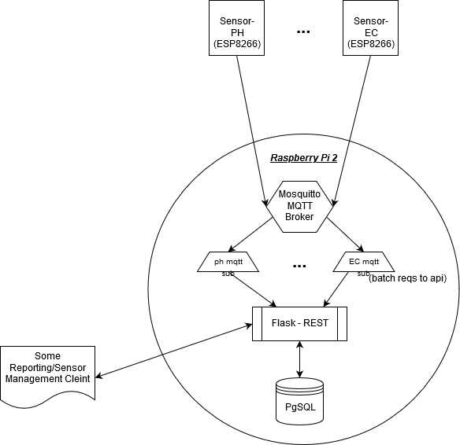

# SnooSongFarms

IoT sendor data persistence pipeline and reporting for my home aquaponics setup. 

### Currently Supporting Sensor Telemetry for:
  
  - PH: [Gravity Analog ph sensor](https://www.dfrobot.com/product-1782.html) sensor module with [ESP8266Wifi](https://arduino-esp8266.readthedocs.io/en/latest/esp8266wifi/readme.html) board.
  
### Pipeline: 

- MQTT: 
    - Publish from the sensor modules with the support of [PubSubClient](https://www.arduinolibraries.info/libraries/pub-sub-client)
    
    - [mosquitto](https://mosquitto.org/) - I run this broker on a raspberry pi 2

    - Subscribe to sensor topics with [paho](https://pypi.org/project/paho-mqtt/) python clients. These clients POST to the system REST API endpoint `/api/telemetry/batch`. Configure batch size from these clients in config.py.
  
- REST API: 
	- a simple [flask](https://www.palletsprojects.com/p/flask/) server running on the pi.
	- endpoint `/api/telemetry/batch` defined for persisting telemetry in an arbitrary batch size. Requires config.py for db connection. 

- Database:
	- Running pgsql server on the pi currently. 
	- Defined `sensor_telemetry` type.
	- Defined `Sensor.PersistTelemetry` function.
	

### System Management & Reporting App:
-  interface to manage the system entities, sensor modules and view data trends
-  just an unimpressive jquery app
-  charting with [chartjs](https://www.chartjs.org/)

